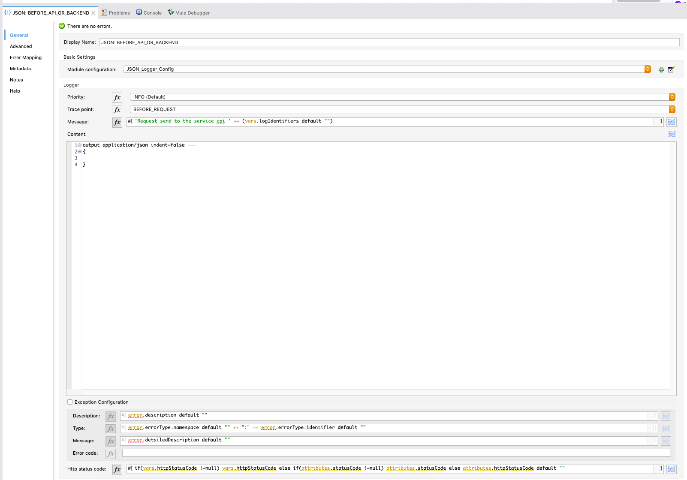

# JSON Logger - Mule 4

Drop-in replacement for default Mule Logger that outputs a JSON structure based on a predefined JSON schema.

## Why?

- Logs are as good as the logging practices applied by developers
- Not all developers think alike on what needs to be logged
- No tools to enforce proper logging standards
- Simple but essential logging best practices (e.g. tie multiple log entries to a single transaction by using a correlation id) are inconsistent and drastically impact troubleshooting capabilities
- The rise of Splunk and other log aggregation platforms is due to their ability to aggregate, understand and exploit data
- These platforms typically understand key=value pairs or JSON data structures. Only then, the full potential of these tools can be unlocked in the form of advanced dashboards and reports

For these reasons and based on previous customer experiences, I created this generic DevKit-based JSON Logger Module.

In a nutshell, by defining the output JSON schema as well as providing some additional DevKit specific details (e.g. default values, default expressions, etc.), we can dynamically generate a module that aligns to that schema.

## New Mule4 Exception

## Installation

Please check this blogpost for more details: https://blogs.mulesoft.com/dev/anypoint-platform-dev/json-logging-in-mule-4-getting-the-most-out-of-your-logs/

## Author

* **Andres Ramirez** [Slack: @andres.ramirez / Email: andres.ramirez@mulesoft.com]

## Contributer

**Srinivasan Raghunathan**
